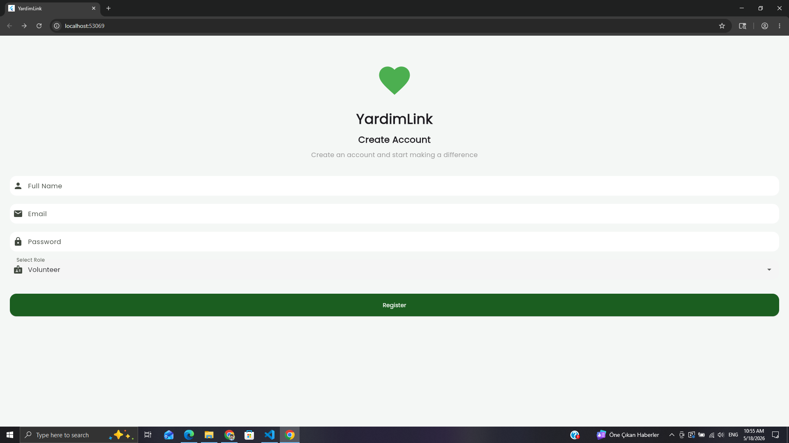
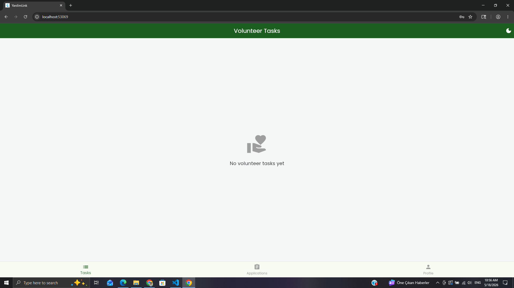
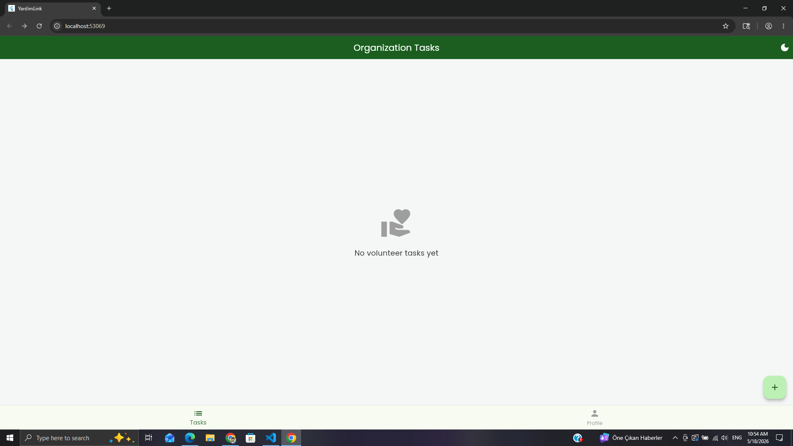
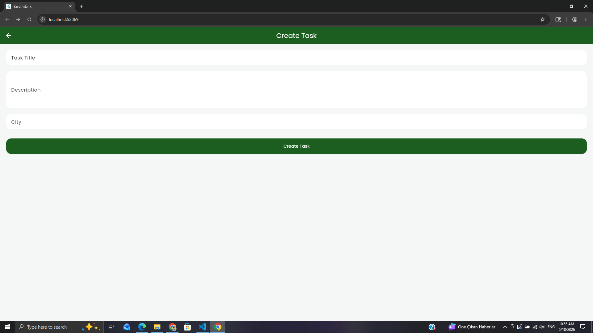
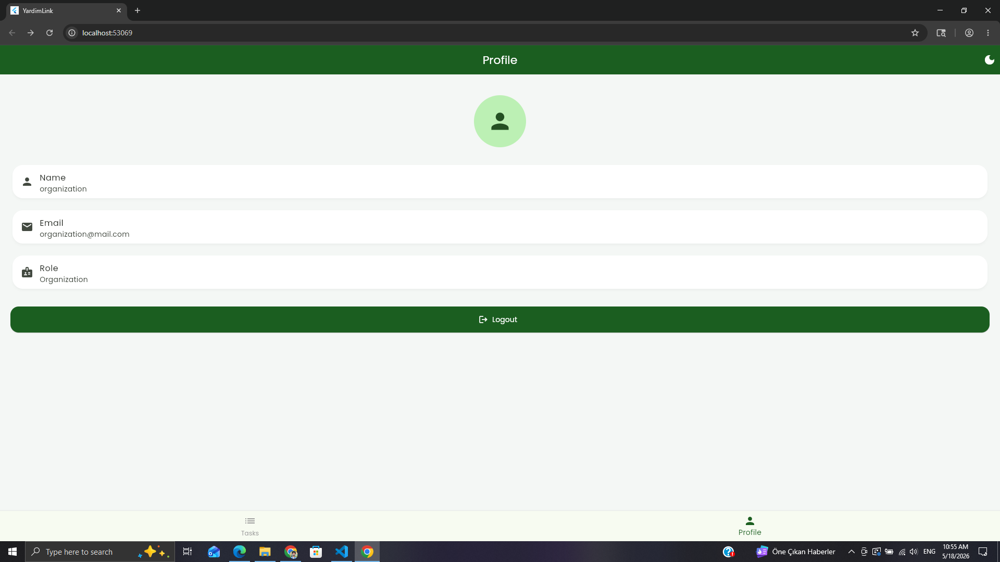
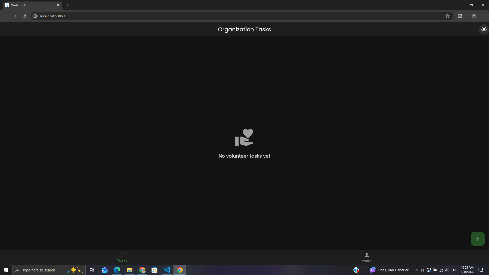

# YardimLink

YardimLink is a Flutter & Firebase based volunteer task matching system developed for the Mobile Programming course.

The platform connects organizations with volunteers through task posting and application management.

## Features

- Firebase Authentication
- Volunteer & Organization roles
- Create/Edit/Delete volunteer tasks
- Task application system
- Real-time Firestore updates
- Dark mode support
- Activity logs
- Responsive UI
- Modern Flutter Material 3 design

## Packages Used

- firebase_core
- firebase_auth
- cloud_firestore
- google_fonts
- flutter
- cupertino_icons

## Screenshots
    ### Login Screen

---

### Register Screen

---

### Volunteer Home Screen

---

### Volunteer Application Screen

---

### Organization Dashboard

---

### Organization Task Creation

---

### Profile Page Preview

---

### Dark Mode

## Test Account Login and Access

## Developers

- Abdullah Zaheer
- 233301112
-Computer Engineering, Selcuk University.